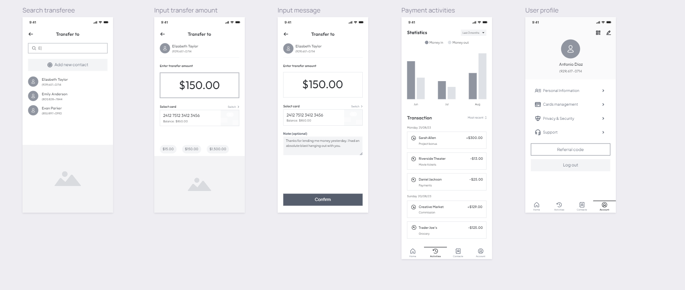
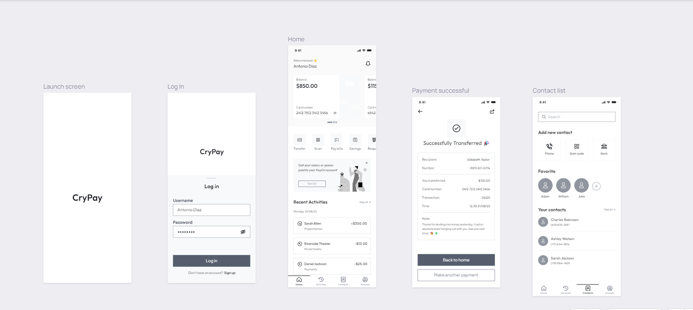

# CryPay

# Reporte General del Prototipo Desarrollado: Pasarela de Pagos Cripto (CryPay)

## Mockup de la aplicación

## Modelo de negocio, modelo de monetización y rentabilidad de la aplicación:

1. **Problemática Detectada dentro de la Vertical:**
   La problemática principal identificada es la dependencia de las tiendas de comercio electrónico de proveedores de pagos tradicionales, lo que implica tarifas elevadas y procesos complejos. Además, la falta de anonimato y seguridad en las transacciones online es una preocupación creciente. La necesidad de una solución que permita transacciones rápidas, seguras y anónimas en todo el mundo es evidente.

2. **Solución Propuesta:**
   La solución propuesta es una Pasarela de Pagos Cripto basada en contratos inteligentes en la cadena de bloques ICP, Ethereum y Bitcoin. Esto elimina la necesidad de intermediarios y proporciona pagos rápidos, seguros y anónimos. La transparencia y la capacidad de realizar reembolsos simples son características clave, brindando a las tiendas de comercio electrónico una alternativa eficiente y rentable.

3. **Aspectos a Integrar de la Tecnología de Internet Computer:**
   La tecnología de Internet Computer (ICP) puede ser integrada para aprovechar su capacidad de ejecución de contratos inteligentes de manera eficiente y sin costos excesivos. La descentralización y la capacidad de escalar horizontalmente son elementos clave para garantizar la disponibilidad y la confiabilidad de la pasarela de pagos.

4. **Modelo de Negocio (Business Model Canvas):**
   - **Socios Clave:** Proveedores de infraestructura blockchain, servicios de billetera cripto, tiendas de comercio electrónico, posibles inversores.
   - **Actividades Clave:** Desarrollo y mantenimiento del contrato inteligente, integración con tiendas, seguridad de transacciones.
   - **Propuesta de Valor:** Pasarela de pago segura, rápida y de bajo costo para transacciones en criptomonedas.
   - **Relación con el Cliente:** Soporte técnico, actualizaciones, comunidad en línea.
   - **Clientes:** Tiendas de comercio electrónico buscando reducir tarifas y ofrecer más opciones de pago.
   - **Recursos Clave:** Equipo de desarrollo, infraestructura blockchain, capital.
   - **Canales:** Sitio web, redes sociales, blogs, conferencias y eventos.

5. **Oportunidad de Mercado:**
   La oportunidad de mercado radica en la creciente demanda de soluciones de pago eficientes en el comercio electrónico. Las tiendas que buscan reducir costos y ofrecer opciones de pago innovadoras constituyen un mercado objetivo significativo. La globalización y la aceptación creciente de criptomonedas también amplían el alcance del proyecto.

6. **Modelo de Monetización:**
   - **Tarifas de Transacción:** Obtención de ingresos a través de tarifas aplicadas a transacciones realizadas en la pasarela.
   - **Tarifas de Suscripción:** Posibles tarifas de suscripción para funciones premium.
   - **Ingresos por Publicidad:** Potencial ingreso mediante publicidad en la plataforma.

7. **Rentabilidad de la Aplicación:**
   La rentabilidad se basa en la generación de ingresos a través de las tarifas de transacción, suscripciones y posibles ingresos publicitarios. La eficiencia operativa, la adopción masiva y la retención de clientes contribuirán a la rentabilidad a largo plazo.

8. **Estrategia de Marketing para Primeros Usuarios:**
   - **Campañas de Concientización:** Utilizar redes sociales, blogs y eventos para dar a conocer la pasarela.
   - **Incentivos para Tiendas Iniciales:** Ofrecer tarifas promocionales o servicios adicionales para las primeras tiendas que adopten la pasarela.
   - **Programas de referencia:** Implementar programas de referencia para atraer a nuevas tiendas.

9. **Plan Estratégico de Crecimiento a Corto, Mediano y Largo Plazo:**
   - **Corto Plazo:** Enfoque en adquisición de clientes, pruebas piloto y retroalimentación.
   - **Mediano Plazo:** Expansión de funciones, asociaciones estratégicas con grandes tiendas y mejora continua.
   - **Largo Plazo:** Exploración de nuevas blockchains, expansión global y diversificación de servicios relacionados con criptomonedas.

## Documentación del proyecto:

**Descripción general:**
El proyecto de pasarela de pagos basada en contratos inteligentes resuelve problemas clave en el comercio electrónico. Elimina tarifas de proveedores de pago, agiliza transacciones internacionales, mejora la transparencia y seguridad, simplifica reembolsos, ofrece anonimato y reduce la dependencia de terceros. Además, facilita la participación de usuarios sin acceso a servicios bancarios tradicionales y promueve nuevos modelos de negocios al proporcionar una alternativa descentralizada y eficiente.

**Pasos para desplegar el Crypay y ver su funcionamiento:**

**Paso 1: Configure el dfx.json archivo.**
Abrir el dfx.json archivo en el directorio de su proyecto. Reemplace el contenido existente con lo siguiente:
{
  "canisters": {

    "icp_ledger_canister": {
      "type": "custom",
      "candid": "ledger/icp_ledger.did",
      "wasm" : "ledger/ledger-canister.wasm.gz",
      "remote": {
        "id": {
          "ic": "ryjl3-tyaaa-aaaaa-aaaba-cai"
        }
      }
    }
  },
  "defaults": {
   
    "build": {
      "args": "",
      "packtool": ""
    }
  },
  "output_env_file": ".env",
  "version": 1
}

**Paso 2: Inicie una réplica local.**
dfx start --background --clean
**Paso 3: Crear una nueva identidad que funcione como una cuenta de acuñación:**
dfx identity new minter
dfx identity use minter
export MINTER_ACCOUNT_ID=$(dfx ledger account-id)
**Paso 4: Vuelva a su identidad predeterminada y registre su identificador de cuenta de libro mayor.**
dfx identity use default
export DEFAULT_ACCOUNT_ID=$(dfx ledger account-id)  
**Paso 5: Implemente el bote del libro mayor con opciones de archivo:**
dfx deploy --specified-id ryjl3-tyaaa-aaaaa-aaaba-cai icp_ledger_canister --argument "

  (variant {

    Init = record {
      minting_account = \"$MINTER_ACCOUNT_ID\";
      initial_values = vec {
        record {
          \"$DEFAULT_ACCOUNT_ID\";
          record {
            e8s = 10_000_000_000 : nat64;
          };
        };
      };
      send_whitelist = vec {};
      transfer_fee = opt record {
        e8s = 10_000 : nat64;
      };
      token_symbol = opt \"LICP\";
      token_name = opt \"Local ICP\";
    }
  })
"
**Paso 6: Interactúa con el bote.**
Puede interactuar con el bote ejecutando comandos CLI, como:
dfx canister call icp_ledger_canister name 
Este comando devolverá el nombre del token, como:
("Local ICP")
**Paso 7: Vuelva a editar el archivo dfx.json de la siguiente manera:**

 {
  "canisters": {

    "crypay": {
      "candid": "src/crypay.did",
      "package": "dapp",
      "type": "rust",
      "dependencies": [
        "icp_ledger_canister"
      ]
    },

    "icp_ledger_canister": {
      "type": "custom",
      "candid": "ledger/icp_ledger.did",
      "wasm" : "ledger/ledger-canister.wasm.gz"
    }
  },

  "defaults": {

    "build": {
      "args": "",
      "packtool": ""
    }
  },
  "output_env_file": ".env",
  "version": 1
}

**Paso 8: Cree el canister Crypay:**

dfx canister create crypay

**Paso 9: Construya el Canister:**

dfx build
**Paso 10: Despliegue el Canister:**

dfx deploy

## Mockup ilustrando la idea de la Aplicación:

**Página de Inicio:**
Interfaz de la tienda de comercio electrónico con opciones de productos.

**Carrito de Compras:**
Vista del carrito de compras con productos seleccionados.

**Proceso de Pago:**
Pantalla de inicio de pago con la opción de seleccionar Pasarela de Pagos Cripto.

**Identificación de Pago:**
Generación de identificador de pago y monto en criptomonedas.

**Uso de una Wallet**
Pantalla de Internet Computer wallet para confirmar el pago.

**Verificación de Estado:**
Pantalla de la tienda mostrando el estado del pago (pagado o pendiente).

**Compleción de Pago:**
Confirmación de la entrega de productos y opción para completar el pago.

**Finalización:**
Confirmación final de la transacción y detalles del pago.
